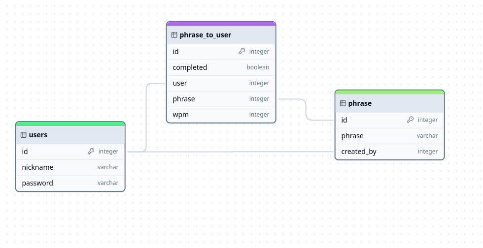

<p align="center">
  
  
</p>

# Aux Typing

Aux Typing is a website to practice your speed of typing with a interfaz 

## Features

- Generates random words
- Trains a neural network to predict the next word in a sequence
- Uses AI to generate words
- Plays with friends and family
- Improves typing speed and accuracy

## Installation

To install Aux Typing, follow these steps:

1. Clone the repository:

```bash
git clone https://github.com/donpal/aux-typing.git
```

1. Install the required dependencies:


  

